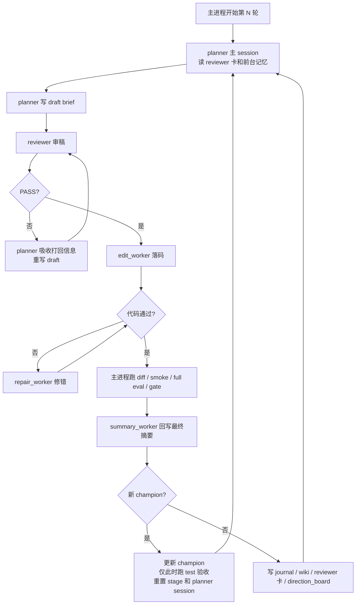

# Quant AI Research

`OKX BTC-USDT-SWAP` 激进趋势策略研究仓库。这里的 `SWAP` 指 OKX 的 `USDT` 本位永续合约。

这个仓库维护的是一条连续研究主线：同一套策略源码、同一套回测器、同一套研究器，以及一套后续可接 `OKX` 自动交易的实盘外壳。当前这个 clone 还额外挂了一条 `planner-only` 的 DeepSeek 对照实验线，用来验证研究方向生成环节是否更适合切模型。

## 当前范围

- 策略源码：[src/strategy_macd_aggressive.py](src/strategy_macd_aggressive.py)
- 回测器：[src/backtest_macd_aggressive.py](src/backtest_macd_aggressive.py)
- 研究器：[scripts/research_macd_aggressive_v2.py](scripts/research_macd_aggressive_v2.py)
- 管理脚本：[scripts/manage_research_macd_aggressive_v2.sh](scripts/manage_research_macd_aggressive_v2.sh)
- stage 重开脚本：[scripts/reset_research_macd_aggressive_v2_stage.sh](scripts/reset_research_macd_aggressive_v2_stage.sh)
- 数据下载脚本：[scripts/download_aggressive_data.py](scripts/download_aggressive_data.py)
- 实盘外壳说明：[real-money-test/README.md](real-money-test/README.md)
- DeepSeek planner 实验说明：[docs/deepseek_planner_experiment.md](docs/deepseek_planner_experiment.md)

每次出现新的 `champion` 时，研究器现在还会额外归档一份独立快照到：

- `backups/champion_history/<timestamp>_i<iteration>_<candidate_id>_<codehash>/`

目录内默认包含：

- `strategy_macd_aggressive.py`
- `metadata.json`
- 若当轮图表生成成功，还会带上 `selection.png` 与 `validation.png`

## 数据与评分

- 数据源：`OKX`
- 事实层：`15m`
- `1h / 4h` 由 `15m` 聚合得到，只做趋势和环境确认
- 回测执行价优先使用 `1m`
- 当前评分口径：`trend_capture_v8`

时间窗口：

- `train`：`2023-07-01` 到 `2024-12-31`
- `val`：`2025-01-01` 到 `2025-12-31`
- `test`：`2026-01-01` 到 `2026-03-31`

晋升规则：

- 候选必须先过 `gate`
- 再满足 `promotion_score` 高于当前 active reference
- `promotion_score` 以 `train/val` 连续趋势抓取分 `5:5` 为主，再混入少量按日收益路径年化分
- `train` 滚动窗口均值/中位数、`val` 分块稳定性和过拟合集中度继续用于 gate 和诊断，不再直接进入晋级主公式
- `test` 只在新 champion 时运行，只做观察记录，不参与晋升，也不进入 prompt
- 复杂度信息现在只做只读诊断，只写入 `journal / wiki` 供人工查看，不再进入 `planner / reviewer` prompt，也不再自动触发压缩任务

## 研究器工作流

研究器围绕一条 `planner -> reviewer -> worker -> eval -> summary` 的主链运行，并且始终只维护一个 active reference。

### Active Reference

- 还没有 `gate-passed` 版本时，active reference 是 `baseline`
- 一旦出现 `gate-passed` 版本，active reference 就是 `champion`
- 只有在刷新 `champion` 时，系统才会重置 stage，并重开 `planner` 的持久会话

### Planner

`planner` 是唯一持有持久 session 的角色，负责提出轮级研究方向，而不是直接写代码。

它每一轮的固定顺序是：

1. 先读 `reviewer_summary_card`、`direction_board` 和前台记忆
2. 先判断上一轮为什么失败，这一轮该继续还是转向
3. 再输出 `draft brief`

`planner` 的职责是想方向，不是绕过审稿，也不是替 worker 直接落细节。

### Reviewer

`reviewer` 是每轮全新的短生命周期审稿 worker。它只审 `planner` 刚写出的 `draft brief`，结论只有：

- `PASS`
- `REVISE`

若 `REVISE`，`planner` 必须先吸收打回理由，再重写 draft；`reviewer` 不能替 `planner` 发明新方向。

### Edit Worker / Repair Worker

- `edit_worker` 只在 `reviewer=PASS` 后出现，负责把放行后的方向落到 [src/strategy_macd_aggressive.py](src/strategy_macd_aggressive.py)
- `repair_worker` 只在同轮技术修错时出现，不参与研究方向判断
- 整份策略文件都允许修改，但要求改动克制、结构准确、添加有必要；策略文件现在同时承载 `PARAMS` 和 `EXIT_PARAMS`
- `EXIT_PARAMS` 中止盈、止损、保本、追踪、持仓时间、趋势失效退出和加仓触发允许被 AI 调整；杠杆、仓位比例、单仓上下限、并发数和加仓规模固定
- planner 可以为单个连续型 `EXIT_PARAMS` 给 `exit_range_scan`，主进程只做轻量预筛，不做多参数网格搜索

### Eval / Summary

- 候选必须先形成真实源码 diff
- 再过 `smoke`
- 如果本轮触达单个连续型 `EXIT_PARAMS`，主进程会先做最多 3 点轻量 range scan，只用少量窗口预筛并只保留最佳值
- context cache 只按真实数据准备依赖建 key，普通止盈/止损/追踪数值变化不会触发重建
- early reject 只在 `10/18/26` 三个 train milestone 做连续 snapshot，避免每个后续窗口都补跑
- behavioral no-op 会先看成交指纹；若成交不变但关键漏斗触达大幅变化，也允许进入后续评估
- 再跑完整 `train walk-forward + val`
- 若刷新 `champion`，只在这时额外跑 `test`
- `summary_worker` 只根据最终真实 diff 回写候选摘要，避免“原 brief”和“最终代码”错位

以下情况会被直接挡下：

- `behavioral_noop`
- 空 diff
- 重复源码
- 重复结果盆地
- 非法 brief
- reviewer 连续打回

complexity 诊断仍会进入 journal 和 wiki，但只作为人工监控指标；研究器不再自动切模式，也不会单独沉淀一条 `working_base`。

## 运行层轻优化

这轮只加了 3 个不改 `SOP / prompt / 评分` 的轻优化：

- `prepared_backtest_context` 现在会按 `策略参数 + exit 参数 + 数据文件签名` 做进程内小缓存，重复 smoke / eval 不再反复准备同一份回测上下文
- active reference 的 base smoke 行为现在会按 `reference code hash + smoke windows + 数据文件签名` 做单份缓存；candidate 端的 smoke 和行为采样合并成一次
- 只有非持久 `Codex` 文本 phase 才会在瞬态报错时立刻短重试 `1` 次；`planner` 持久 session 和外层 provider 恢复退避语义保持不变

## Agent / Subagent 工作流

下面这张图按“竖着看”的方式画，`planner` 的持久主 session 在中轴；其余都是围绕它工作的短生命周期 subagent。



当前这套工作流的核心意思是：

- `planner` 先给方向，不直接下最终落码指令
- `reviewer` 负责拦坏 draft，不负责发明新方向
- `worker` 只对 reviewer 放行后的方向负责
- `summary_worker` 只根据真实 diff 写结果，避免“口头方向”和“实际代码”错位
- 如果本轮没有刷新 `champion`，主进程会把结果写回 `journal / wiki / reviewer_summary_card / direction_board`，然后直接开始下一轮
- 如果本轮刷新了 `champion`，主进程会更新 active reference，只在这时额外跑 `test`，并开启新的 stage / planner session

更完整的说明见 [docs/agent_subagent_workflow.md](docs/agent_subagent_workflow.md)。

## DeepSeek Planner 实验现状

当前这个 `TEST4-Deepseekv4` clone 采用的是 `planner-only` 的 DeepSeek 实验接法。

### 当前接法

- `planner`：走 DeepSeek 官方兼容 API
- `planner` 当前模型：`deepseek-v4-pro`
- `thinking`：开启
- `reasoning_effort`：`max`
- `reviewer / edit_worker / repair_worker / summary_worker`：继续走原来的 Codex / GPT 链路
- 切换入口：`config/secrets.env` 中的 `MACD_V2_PLANNER_PROVIDER=deepseek`
- 生效范围：只有 `session_kind=planner` 时才会走 DeepSeek
- 规则继承方式：实验接法会把工作区 `AGENTS.md` 的全文显式注入 `planner` 的 system prompt，保证原有 `apply on planner` 规则继续生效
- DeepSeek planner 的多轮上下文保存在 `state/research_macd_aggressive_v2_agent_workspace/.deepseek_planner_session_*.json`
- DeepSeek planner 的 trace 额外保存在 `state/research_macd_aggressive_v2_agent_workspace/.deepseek_planner_trace_*.jsonl`

### 当前实验结论

截至 `2026-04-24` 这轮对照实验，当前观察是：

- `GPT` 更适合固定框架、规则严密、执行链稳定的角色，例如 `reviewer / edit_worker / repair_worker / summary_worker`
- `DeepSeek` 在发散找方向、提出新假设、快速换研究层级这类 `planner` 任务里，当前表现更好

这个结论只针对当前仓库、当前评分口径 `trend_capture_v8` 和当前这组实验流程成立，不把它外推成所有任务的一般结论。

### 为什么保留混合架构

当前更合适的不是“全链路都换 DeepSeek”，而是：

- 让 `DeepSeek V4 Pro` 负责 `planner`
- 让原来的 Codex / GPT 链继续负责审稿、落码、修错和结果收口

原因是当前实验里，DeepSeek 更容易更快换出新方向，但 GPT 在代码层对齐、规则约束和执行链稳定性上仍然更稳。

## 手工瘦身 SOP

当前复杂度不再由系统自动压缩。推荐人工 SOP：

1. 停掉研究器
2. 手工瘦身当前策略，或手工替换 active reference
3. 执行 [scripts/reset_research_macd_aggressive_v2_stage.sh](scripts/reset_research_macd_aggressive_v2_stage.sh)
4. 重新启动研究器，进入新 stage

这个脚本会保留 `memory/raw/*`，但清空 front memory、session、workspace 和当前 stage journal。

## 常用命令

下载或重建本地 OKX 数据：

```bash
python3 scripts/download_aggressive_data.py
```

启动研究器：

```bash
bash scripts/manage_research_macd_aggressive_v2.sh start
```

查看状态：

```bash
bash scripts/manage_research_macd_aggressive_v2.sh status
```

停止研究器：

```bash
bash scripts/manage_research_macd_aggressive_v2.sh stop
```

重开一个新 stage：

```bash
bash scripts/reset_research_macd_aggressive_v2_stage.sh
```

单轮运行一次研究器：

```bash
python3 scripts/research_macd_aggressive_v2.py --once
```

## 文档导航

- [STRATEGY.md](STRATEGY.md)
  用非工程语言解释当前策略在看什么、怎么开仓、怎么退出。
- [docs/macd_aggressive_current_state.md](docs/macd_aggressive_current_state.md)
  解释当前评分、gate、session、memory、Discord 播报和运行目录。
- [docs/agent_subagent_workflow.md](docs/agent_subagent_workflow.md)
  专门解释 `planner / reviewer / edit_worker / repair_worker / summary_worker / 主进程` 之间怎么配合。
- [docs/deepseek_planner_experiment.md](docs/deepseek_planner_experiment.md)
  专门解释当前 `planner-only` DeepSeek 实验是怎么接的、当前观察是什么。
- [real-money-test/README.md](real-money-test/README.md)
  解释 `freqtrade` dry-run / live 外壳如何接这套策略。

## 目录速览

```text
config/              研究器配置、凭证样板、人工方向卡
data/                OKX 价格、funding、指数数据
docs/                当前状态文档
logs/                研究器日志与模型调用日志
real-money-test/     freqtrade dry-run / live 外壳
scripts/             下载、研究、管理、stage reset 脚本
src/                 策略、回测器、研究器依赖模块
state/               active reference 状态、journal、memory、heartbeat、session
tests/               研究器相关测试
```
