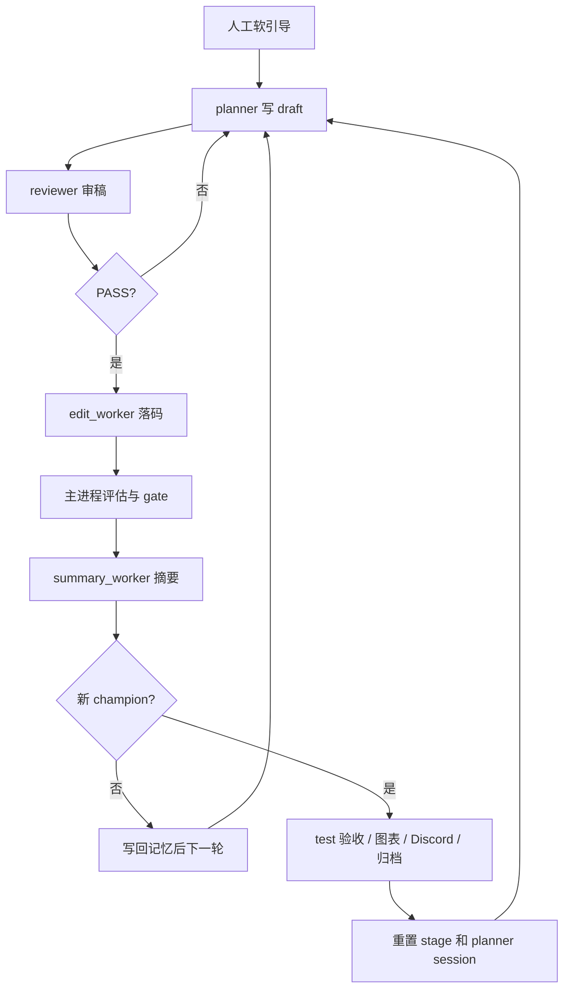

# Quant AI Research

`OKX BTC-USDT-SWAP` 激进趋势策略研究仓库。这里的 `SWAP` 指 OKX 的 `USDT` 本位永续合约。

这个仓库维护的是一条连续研究主线：同一套策略源码、同一套回测器、同一套研究器，以及一套后续可接 `OKX` 自动交易的实盘外壳。当前这个 clone 还额外挂了一条 `planner-only` 的 DeepSeek 对照实验线，用来验证研究方向生成环节是否更适合切模型。

## 当前范围

- 策略源码：[src/strategy_macd_aggressive.py](src/strategy_macd_aggressive.py)
- 回测器：[src/backtest_macd_aggressive.py](src/backtest_macd_aggressive.py)
- 研究器：[scripts/research_macd_aggressive_v2.py](scripts/research_macd_aggressive_v2.py)
- 管理脚本：[scripts/manage_research_macd_aggressive_v2.sh](scripts/manage_research_macd_aggressive_v2.sh)
- stage 重开脚本：[scripts/reset_research_macd_aggressive_v2_stage.sh](scripts/reset_research_macd_aggressive_v2_stage.sh)
- 数据下载脚本：[scripts/download_aggressive_data.py](scripts/download_aggressive_data.py)
- 实盘外壳说明：[real-money-test/README.md](real-money-test/README.md)
- DeepSeek planner 实验说明：[docs/deepseek_planner_experiment.md](docs/deepseek_planner_experiment.md)

每次出现新的 `champion` 时，研究器现在还会额外归档一份独立快照到：

- `backups/champion_history/<timestamp>_i<iteration>_<candidate_id>_<codehash>/`

目录内默认包含：

- `strategy_macd_aggressive.py`
- `metadata.json`
- 若当轮图表生成成功，还会带上 `selection.png` 与 `validation.png`

## 数据与评分

- 数据源：`OKX`
- 事实层：`15m`
- `1h / 4h` 由 `15m` 聚合得到，只做趋势和环境确认
- 回测执行价优先使用 `1m`
- 当前评分口径：`trend_capture_v14_midfreq_sharpe_floor_balance`

时间窗口：

- `train`：`2023-07-01` 到 `2024-12-31`
- `val`：`2025-01-01` 到 `2025-12-31`
- `test`：`2026-01-01` 到 `2026-04-20`

晋升规则：

- 候选必须先过 `gate`
- 再满足 `promotion_score` 达到当前 active reference 之上的最小晋级边际；若 `quality_score` 回落，则需要更高边际
- `promotion_score = 0.45 * capture_score + 0.30 * timed_return_score + 0.25 * sharpe_floor_score - drawdown_penalty_score - robustness_penalty_score`
- `capture_score` 不再只由最大趋势段主导；`train/val` 连续趋势抓取分改为“段等权均分 50% + 原权重均分 50%”的混合方式
- `val` 年内平仓数至少 `180` 笔，约等于每月 `15` 笔，交易数只做 gate，不单独加分
- 鲁棒性软惩罚只看 `train/val` 落差、`val` 分块稳定性，以及退出参数邻域在 `val` 3 段上的平台形态；当前更明确压 `val` 最差块、尾块和 `train/val` Sharpe gap，弱侧 Sharpe 通过 `sharpe_floor_score` 进入主分
- `train` 滚动窗口均值/中位数、`val` 分块稳定性和过拟合集中度继续用于 gate 和诊断，不再直接进入晋级主公式
- `test` 对新 champion 同步运行；对已完成完整评估但未保留的候选会后台异步补跑关键指标，只做观察记录，不参与晋升，也不进入 prompt
- 复杂度信息现在只做只读诊断，只写入 `journal / wiki` 供人工查看，不再进入 `planner / reviewer` prompt，也不再自动触发压缩任务
- `config/research_v2_champion_review.md` 是绑定当前 champion hash 的人工观察卡，只给 planner 做软引导；新 champion 后自动忽略，直到人工更新 hash。

## 研究器工作流

研究器当前按 [docs/agent_subagent_workflow.md](docs/agent_subagent_workflow.md) 的 SOP 运行。核心链路是：

```text
人工软引导 -> planner draft -> reviewer 审稿 -> edit_worker 落码 -> 主进程评估 -> summary_worker 摘要 -> champion 或下一轮
```

关键点：

- `planner` 是唯一持久 session，只负责想方向和写 `draft brief`。
- `reviewer` 每轮 fresh，只判断 draft 是否值得落码，结论只有 `PASS / REVISE`。
- `edit_worker` 只改 [src/strategy_macd_aggressive.py](src/strategy_macd_aggressive.py)。
- 主进程负责 `diff / smoke / behavioral_noop / exit_range_scan / full eval / gate / 归档 / 播报`。
- 没有刷新 `champion` 时，结果写回 `journal / wiki / reviewer_summary_card / direction_board`；若该轮已完成 full eval，还会后台异步补跑 `test` 关键指标留档，然后继续同一 stage。
- 同一 stage 内，即使出现 reviewer 打回、`behavioral_noop`、同轮重生或方向切换，`planner` 也不自动重置 session；只有手工重开 stage 或刷新 `champion` 才重置。
- 刷新 `champion` 时，会同步跑 `test`、归档快照，然后重置 stage 和 planner session。
- `config/research_v2_champion_review.md` 是绑定当前 champion hash 的短人工观察卡；新 champion 后自动失效。

当前为了控制主文件体积，研究器相关代码已经拆到这些辅助模块：

- `src/research_v2/reference_state.py`：active reference 持久化与恢复
- `src/research_v2/champion_artifacts.py`：champion 快照与图表说明
- `src/research_v2/backtest_window_runtime.py`：回测窗口切片与运行态准备
- `src/research_v2/evaluation_summary.py`：评分汇总文本与指标组装
- `src/research_v2/journal_prompt_builder.py`：journal prompt 摘要组装



## DeepSeek Planner 实验现状

当前仓库采用的是 `planner-only` 的 DeepSeek 实验接法。

### 当前接法

- `planner`：走 DeepSeek 官方兼容 API
- `planner` 当前模型：`deepseek-v4-pro`
- `thinking`：开启
- `reasoning_effort`：`max`
- `reviewer / edit_worker / repair_worker / summary_worker`：继续走原来的 Codex / GPT 链路
- 切换入口：`config/secrets.env` 中的 `MACD_V2_PLANNER_PROVIDER=deepseek`
- 生效范围：只有 `session_kind=planner` 时才会走 DeepSeek
- 规则继承方式：实验接法会把工作区 `AGENTS.md` 的全文显式注入 `planner` 的 system prompt，保证原有 `apply on planner` 规则继续生效
- DeepSeek planner 的多轮上下文保存在 `state/research_macd_aggressive_v2_agent_workspace/.deepseek_planner_session_*.json`
- DeepSeek planner 的 trace 额外保存在 `state/research_macd_aggressive_v2_agent_workspace/.deepseek_planner_trace_*.jsonl`
- 同一 stage 内不会因为 `behavioral_noop`、reviewer 打回或方向切换而重置 planner session
- 本地 session 默认只保留最近 `12` 条非 system 历史消息；`reasoning_content` 只写 trace，不再回灌到 session history
- 模型调用 telemetry 同时记录原始 prompt 大小与真实发送上下文大小，便于核对内联 `AGENTS.md` 和历史消息带来的成本

### 当前实验结论

截至 `2026-04-26` 这轮运行观察，当前观察是：

- `GPT` 更适合固定框架、规则严密、执行链稳定的角色，例如 `reviewer / edit_worker / repair_worker / summary_worker`
- `DeepSeek` 在发散找方向、提出新假设、快速换研究层级这类 `planner` 任务里，当前表现更好

这个结论只针对当前仓库、当前评分口径 `trend_capture_v14_midfreq_sharpe_floor_balance` 和当前这组实验流程成立，不把它外推成所有任务的一般结论。

### 为什么保留混合架构

当前更合适的不是“全链路都换 DeepSeek”，而是：

- 让 `DeepSeek V4 Pro` 负责 `planner`
- 让原来的 Codex / GPT 链继续负责审稿、落码、修错和结果收口

原因是当前实验里，DeepSeek 更容易更快换出新方向，但 GPT 在代码层对齐、规则约束和执行链稳定性上仍然更稳。

## 手工瘦身 SOP

当前复杂度不再由系统自动压缩。推荐人工 SOP：

1. 停掉研究器
2. 手工瘦身当前策略，或手工替换 active reference
3. 执行 [scripts/reset_research_macd_aggressive_v2_stage.sh](scripts/reset_research_macd_aggressive_v2_stage.sh)
4. 重新启动研究器，进入新 stage

这个脚本会保留 `memory/raw/*`，但清空 front memory、session、workspace 和当前 stage journal。

补充两条边界：

- 研究器是由 `scripts/run_research_macd_aggressive_v2.sh` 的 supervisor 拉起；手工停机要走 `bash scripts/manage_research_macd_aggressive_v2.sh stop`，不要只杀 python 子进程，否则会被自动拉起。
- 研究器启动时会先从 `backups/strategy_macd_aggressive_v2_best.py` 载入 active reference 并回写到 `src/strategy_macd_aggressive.py`；手工瘦身当前基底时，要同步 `src` 与 `best/champion` 快照。

## 常用命令

下载或重建本地 OKX 数据：

```bash
python3 scripts/download_aggressive_data.py
```

启动研究器：

```bash
bash scripts/manage_research_macd_aggressive_v2.sh start
```

查看状态：

```bash
bash scripts/manage_research_macd_aggressive_v2.sh status
```

停止研究器：

```bash
bash scripts/manage_research_macd_aggressive_v2.sh stop
```

重开一个新 stage：

```bash
bash scripts/reset_research_macd_aggressive_v2_stage.sh
```

单轮运行一次研究器：

```bash
python3 scripts/research_macd_aggressive_v2.py --once
```

## 文档导航

- [STRATEGY.md](STRATEGY.md)
  用非工程语言解释当前策略在看什么、怎么开仓、怎么退出。
- [docs/macd_aggressive_current_state.md](docs/macd_aggressive_current_state.md)
  解释当前评分、gate、session、memory、Discord 播报和运行目录。
- [docs/agent_subagent_workflow.md](docs/agent_subagent_workflow.md)
  专门解释 `planner / reviewer / edit_worker / repair_worker / summary_worker / 主进程` 之间怎么配合。
- [docs/deepseek_planner_experiment.md](docs/deepseek_planner_experiment.md)
  专门解释当前 `planner-only` DeepSeek 实验是怎么接的、当前观察是什么。
- [real-money-test/README.md](real-money-test/README.md)
  解释 `freqtrade` dry-run / live 外壳如何接这套策略。

## 目录速览

```text
config/              研究器配置、凭证样板、人工方向卡
data/                OKX 价格、funding、指数数据
docs/                当前状态文档
logs/                研究器日志与模型调用日志
real-money-test/     freqtrade dry-run / live 外壳
scripts/             下载、研究、管理、stage reset 脚本
src/                 策略、回测器、研究器依赖模块
state/               active reference 状态、journal、memory、heartbeat、session
tests/               研究器相关测试
```
