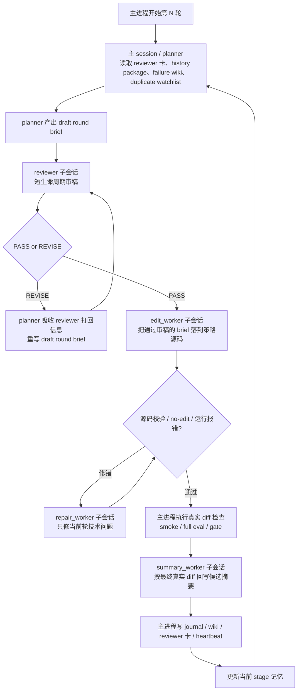

# Agent / Subagent Workflow

这份文档专门解释当前研究器里，主 session 和各个短生命周期 subagent 是怎么配合的。

## 一图看懂

图按“竖着看”的方式设计，`planner` 的持久主 session 在中轴。

## 各角色职责

### 1. planner

- 这是唯一的持久主 session。
- 它负责读当前 stage 的前台记忆，然后提出本轮 `draft round brief`。
- 它负责研究方向，但它现在没有“直接落码”的权力。
- 如果 `reviewer` 打回，它必须先吸收打回理由，再重写 draft。

一句话：
`planner` 负责“想方向”，但不能绕过审稿。

### 2. reviewer

- 这是每轮都新开的短生命周期审稿 subagent。
- 它只看一小包高信号证据，再审 planner 刚写出的 draft。
- 它只能输出两种结论：
  - `PASS`
  - `REVISE`
- 它不能替 planner 发明新方向，也不能直接写代码。

它主要判断的是：

- 这份 draft 是否仍落在最近重复失败核附近
- 这份 draft 是否只是换了措辞、tag 或近邻阈值
- 这份 draft 虽然还是做 `long`，但是否已经换了机制层、关键 choke point 或真实交易路径层级

一句话：
`reviewer` 负责“拦坏 draft”，不是“代替 planner”。

### 3. edit_worker

- 只接收 reviewer 放行后的 brief。
- 它不做研究方向判断，只负责把 brief 落到 `src/strategy_macd_aggressive.py`。
- 它是短生命周期 worker，不继承 planner 的长历史。

一句话：
`edit_worker` 负责“把通过审稿的方向真正写进代码”。

### 4. repair_worker

- 只在当前轮出现技术错误时才会被拉起。
- 例如：
  - no-edit
  - 变量丢失
  - helper 缺失
  - 代码校验失败
- 它不重新定义研究方向，只修当前轮的技术问题。

一句话：
`repair_worker` 负责“修技术错误，不改研究主题”。

### 5. summary_worker

- 只根据最终真实 diff 和当前最终代码回写候选摘要。
- 它的存在是为了避免“planner 原本想改什么”和“代码最后真正改了什么”发生错位。

一句话：
`summary_worker` 负责“按最终代码回写真实候选说明”。

### 6. 主进程

- 主进程不负责想策略。
- 它负责 orchestration：
  - 拉起各个 agent
  - 控制顺序
  - 做真实 diff 检查
  - 跑 `smoke`
  - 跑完整评估
  - 执行 `gate`
  - 写 `journal / wiki / heartbeat / reviewer_summary_card`

一句话：
主进程负责“调度和判卷”。

## 当前为什么要改成这套

之前的问题是：

- `planner` 虽然能看到失败历史
- 但它会持续替自己上一轮的方向辩护
- 于是不断在同一个失败子路线上近邻试错

现在加上 `reviewer` 后，目标不是硬编码限制策略内容，而是把“是否值得继续试这条线”从 `planner` 自己手里拿出来，交给一个每轮 fresh 的审稿人。

所以现在的约束不是：

- “不准改这个 cluster”
- “不准改这几个函数”
- “不准继续做 long”

而是：

- 你可以继续做 `long`
- 但如果这份 draft 本质上还是旧失败近邻，就先不要进入落码

## 现在每轮到底怎么跑

一轮的真实顺序是：

1. 主进程准备当前 active reference 和当前 stage 记忆
2. `planner` 产出 `draft brief`
3. `reviewer` 审稿
4. 若 `REVISE`，回到 `planner`，按 reviewer 打回理由重写
5. 若 `PASS`，进入 `edit_worker`
6. 若代码有技术错误，进入 `repair_worker`
7. 通过后由主进程做 `smoke / full eval / gate`
8. `summary_worker` 回写最终候选摘要
9. 主进程写回 `journal / wiki / reviewer_summary_card`
10. 下一轮 `planner` 再先读这些前台记忆

## 和旧流程相比，最大的变化

以前更像：

`planner -> edit_worker -> 主进程评估`

现在是：

`planner draft -> reviewer -> planner revise -> edit_worker -> 主进程评估 -> summary_worker`

关键区别只有一个：

以前 `planner` 写完就能落码。  
现在 `planner` 先过审，再落码。

## 现在前台记忆里最关键的文件

- `wiki/reviewer_summary_card.md`
  上一轮 reviewer 为什么放行或打回
- `wiki/latest_history_package.md`
  当前 stage 的执行摘要、失败核、过热簇和最近轮次
- `wiki/failure_wiki.md`
  去重后的失败模式聚合
- `wiki/duplicate_watchlist.md`
  最近最容易重复提交的补丁摘要
- `wiki/last_rejected_snapshot.md`
  最近一次被系统判错的快照

其中最靠前的是：

1. `reviewer_summary_card.md`
2. `latest_history_package.md`
3. `failure_wiki.md`
4. `duplicate_watchlist.md`

## 一句话总结

当前研究器的核心工作流是：

`持久 planner 想方向，fresh reviewer 审方向，worker 落代码，主进程判结果，再把结果写回前台记忆给下一轮继续用。`
