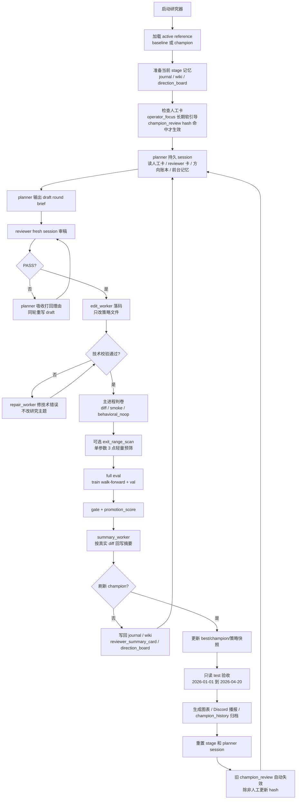

# 研究器 SOP

这份文档是当前 GitHub 内的主 SOP，描述研究器从启动、出方案、落码、评估、刷新 champion 到人工介入的完整流程。

## 一图看懂



## 核心原则

- 研究器只维护一个 active reference：没有合格版本时是 `baseline`，有合格版本后是 `champion`。
- `planner` 负责想方向，不直接写代码；`reviewer` 负责拦坏方向，不替 planner 发明方向。
- `edit_worker` 只把 reviewer 放行后的方向落到 `src/strategy_macd_aggressive.py`。
- 主进程负责判卷，不负责想策略。
- `test` 只在新 champion 后运行，只做只读验收，不参与晋升，也不进入普通调参循环。
- 人工卡都是软引导，不是硬 gate；当前 champion 人工观察卡必须 hash 命中才会给 planner 看。

## 当前数据与评分口径

- 标的：`BTC-USDT-SWAP`，策略按 `20x` 合约研究。
- 事实层：`15m`；`1h / 4h` 由 `15m` 聚合，只做确认层。
- 执行层：优先使用 `1m` 回测成交。
- 评分口径：`trend_capture_v11_piecewise_drawdown_penalty`。
- `train`：`2023-07-01` 到 `2024-12-31`。
- `val`：`2025-01-01` 到 `2025-12-31`。
- `test`：`2026-01-01` 到 `2026-04-20`。
- 晋升条件：先过 `gate`，再要求 `promotion_score` 高于当前 active reference。
- `promotion_score` 以 `train/val` 连续趋势抓取分 `5:5` 为主，加少量按日收益路径年化分，再减去分段回撤惩罚：回撤先按固定窗口风险做基础扣分，超过拐点后按更陡斜率追加扣分。

## 每一轮怎么跑

1. 主进程读取当前 active reference、窗口配置和 stage 记忆。
2. 若 `config/research_v2_champion_review.md` 的 `champion_code_hash` 命中当前 champion，注入这张人工观察卡；否则忽略。
3. `planner` 读取人工卡、上一轮 reviewer 卡、方向账本和前台记忆，写一个单一假设的 draft brief。
4. `reviewer` 审稿，只输出 `PASS` 或 `REVISE`。
5. 若 `REVISE`，planner 必须吸收打回理由，同轮重写；连续打回则本轮停止。
6. 若 `PASS`，`edit_worker` 把方向落到策略源码。
7. 若出现 no-edit、语法错误、缺 helper、校验失败等技术问题，`repair_worker` 只修技术错误。
8. 主进程检查真实 diff、重复源码、smoke 行为和关键漏斗变化。
9. 如果 brief 指定单个连续型 `EXIT_PARAMS` 的 `exit_range_scan`，主进程最多扫 3 个值，只做轻量预筛。
10. 主进程跑完整 `train walk-forward + val`，并执行 gate 与 promotion 判断。
11. `summary_worker` 按最终真实 diff 回写候选摘要。
12. 没有刷新 champion：写回 `journal / wiki / reviewer_summary_card / direction_board`，进入下一轮。
13. 刷新 champion：更新策略快照，只在此时跑 `test`，生成图表和 Discord 播报，归档 `champion_history`，然后重置 stage 与 planner session。

## 各角色职责

### planner

- 唯一持久 session。
- 负责提出研究方向和单一可证伪假设。
- 必须先读当前人工卡、reviewer 卡、direction board 和前台记忆。
- 如果 reviewer 打回，必须先吸收打回理由再重写。

### reviewer

- 每轮 fresh session。
- 只审 planner 的 draft 是否值得落码。
- 重点检查是否旧失败近邻、是否只换标签、是否说明真实交易路径变化。
- 不写代码，不替 planner 提新方案。

### edit_worker

- 只接收 reviewer 放行后的 brief。
- 只改 `src/strategy_macd_aggressive.py`。
- `PARAMS` 和开放的 `EXIT_PARAMS` 都可调整。
- 杠杆、仓位比例、单仓上下限、并发数和加仓规模保持固定。

### repair_worker

- 只处理同轮技术错误。
- 不改研究主题，不重新想方向。

### summary_worker

- 只根据最终源码 diff 和最终候选代码写摘要。
- 用来避免“planner 原本想改什么”和“代码实际改了什么”错位。

### 主进程

- 负责调度、校验、评估、gate、归档、播报和记忆回写。
- 不替 planner 想策略。

## 人工介入 SOP

### 临时给 planner 一句直觉

编辑：`config/research_v2_champion_review.md`

要求：

- 内容应短尽短。
- 必须保留 `champion_code_hash`。
- 只写针对当前 champion 的观察。
- 新 champion 后 hash 不匹配，旧卡会自动失效。

当前示例：

```text
champion_code_hash: <当前 champion hash>

直觉看了一下图片，觉得现在的问题在退出方向，应该想办法保住收益。
```

### 长期方向偏好

编辑：`config/research_v2_operator_focus.md`

用途：长期软引导，例如优先方向、降权方向、默认动作。它不绑定 champion hash，不会自动失效。

### 手工瘦身或替换 active reference

1. 停掉研究器：`bash scripts/manage_research_macd_aggressive_v2.sh stop`
2. 手工修改策略或替换 active reference。
3. 重开 stage：`bash scripts/reset_research_macd_aggressive_v2_stage.sh`
4. 启动研究器：`bash scripts/manage_research_macd_aggressive_v2.sh start`
5. 跟状态：`bash scripts/manage_research_macd_aggressive_v2.sh status`

## 常用命令

```bash
# 启动
bash scripts/manage_research_macd_aggressive_v2.sh start

# 查看状态
bash scripts/manage_research_macd_aggressive_v2.sh status

# 停止
bash scripts/manage_research_macd_aggressive_v2.sh stop

# 重开 stage
bash scripts/reset_research_macd_aggressive_v2_stage.sh

# 单轮运行
python3 scripts/research_macd_aggressive_v2.py --once

# 重建 OKX 数据
python3 scripts/download_aggressive_data.py
```

## 运行产物

- `state/research_macd_aggressive_v2_best.json`：当前 best/champion 状态。
- `backups/strategy_macd_aggressive_v2_best.py`：当前 best 策略快照。
- `backups/strategy_macd_aggressive_v2_champion.py`：当前 champion 策略快照。
- `backups/strategy_macd_aggressive_v2_candidate.py`：运行中的候选快照，不应随手提交。
- `backups/champion_history/`：每次新 champion 的独立归档。
- `reports/research_v2_charts/`：selection / validation 图表。
- `logs/macd_aggressive_research_v2.log`：主日志。
- `logs/macd_aggressive_research_v2_model_calls.jsonl`：模型调用日志。
- `state/research_macd_aggressive_v2_memory/wiki/`：前台记忆、方向账本、失败 wiki、reviewer 卡。

## 提交代码时的注意事项

- 研究器运行中会持续改写候选和策略文件。
- 只想提交当前 champion 时，先停研究器，再排除 `backups/strategy_macd_aggressive_v2_candidate.py`。
- 文档、配置或流程改动完成后，要同步更新文档并推送 git。
- 不要把运行中的候选误当成稳定 champion 提交。
